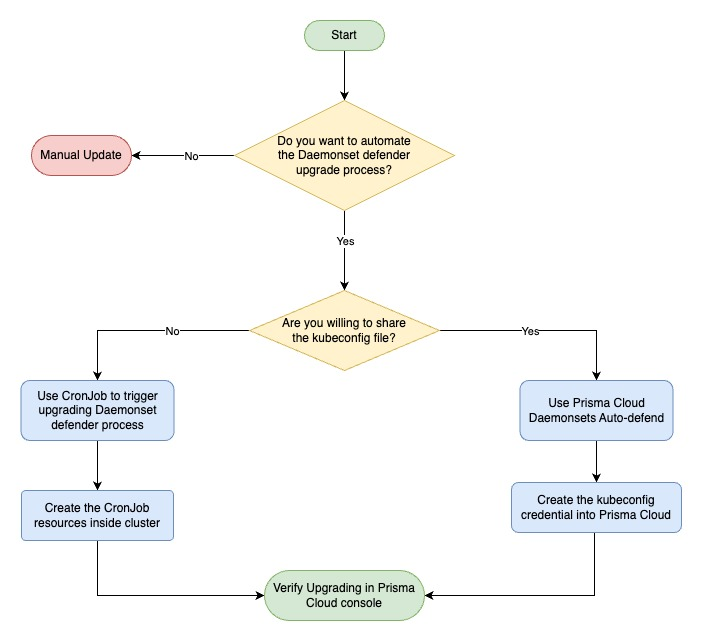
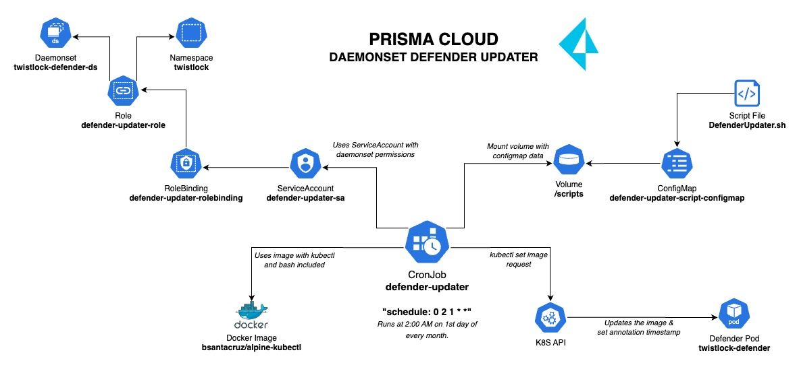

# Prisma Cloud Defender Daemonset Updater 💡

A project to provide a solution to update automatically the Prisma Cloud Daemonset Defender without need to share your kubeconfig file.

## Opportunity 🎯

When you are trying to upgrade the Prisma Cloud Daemonset Defender you need gain access to the cluster, however share either your cluster kubeconfig file or credentials may involve unneeded risks, there's an opportunity to provide a solution to manage the upgrade process from inside the cluster in scheduled way. A quick look for the flow is:



## Solution Architecture 📌

This solution assumes that you have deployed any earlier version of Prisma Cloud Defender (Daemonset) running in your K8S Cluster. In this use case we'll use _'twistlock'_ namespace, same as default defender template namespace.

In this solution it's used K8S core resources like: CronJob, ServiceAccount, Role, RoleBinding, Volume, ConfigMap, etc... A brief look of the solution is:



The tree directory for project is:

      .
      ├── Dockerfile                      # Docker Image.
      ├── README.md                       # Project's Docs.
      ├── ./images
      │   ├── Flow Diagram.jpg            # Opportunity Flow.
      │   └── Solution'sDiagram.jpg       # Solution Proposal.
      ├── ./scripts
      │   └── DefenderUpdater.sh          # Raw script for automation.
      └── ./yaml
         ├── ConfigMap.yaml               # ConfigMap to provide data script.
         ├── CronJob.yaml                 # CronJob to execute the configmap script.
         └── RBAC.yaml                    # Secrets & RBAC required by automation.

**Note: Fork or clone this project in your own environment to start.**

## Prerequisites 🔒

- Prisma Cloud CWP API Credentials - base64 encoded.
- Kubectl client connection to your clusters.
- For or clone this project repository.

## Building & Publishing Docker Image (Optional) ❔

**Disclaimer 1:** You can omit this steps and directly use the pre-created docker image "bsantacruz/alpine-kubectl:2.1" located in Docker Hub.

1. Open Terminal and Go to the directory where you clone this repository.

2. Build Docker Image & verify it's contents.

   ```
   docker build -t alpine-kubectl:1.0 .
   docker run alpine-kubectl:1.0 /bin/sh
   kubectl version --client
   curl --version
   bash --version
   jq --version
   ls -l
   exit
   ```

3. Login to Docker Hub & publish your Docker Image.

   ```
   docker login
   docker tag alpine-kubectl:1.0 "$yourUsername"/alpine-kubectl:1.0
   docker push "yourUsername"/alpine-kubectl:1.0
   ```

   _Don't forget to change "$yourUsername" parameter_

**Note:** If you want you can use the pre-builded docker image located in DockerHub repo: **bsantacruz/alpine-kubectl**

## Deploying Updater into K8S Cluster ✳️

Before deploy the resources you need to modify it with your own values

- **Disclaimer 1:** Open the file `./yaml/RBAC.yaml` & don't forget to change **data.AK** & **data.SK** for your own Prisma Cloud base64 encoded credentials in Secret resource.

- **Disclaimer 2:** Open `./scripts/DefenderUpdater.sh` file and set the variables **AK, SK, API_URL, DAEMONSET_NAME & CONTAINER_NAME, NAMESPACE** with your own values, copy entire content.

- **Disclaimer 3:** Open `./yaml/ConfigMap.yaml` file and replace ConfigMap data section with the content copied above, don't forget to adjust the indentation.

- **Disclaimer 4:** Open the `./yaml/CronJob.yaml` file and modify parameters like _'spec.schedule_ (in UTC time) and any others you requires.

1. Connect to your cluster and create the RBAC & Secret resources needed to interact with daemonsets in 'twistlock' namespace.

   ```
   cd yaml
   # Create RBAC & Secret resources:
   kubectl create -f RBAC.yaml -n twistlock
   # Verify Service Account permissions:
   kubectl auth can-i --as=system:serviceaccount:twistlock:defender-updater-sa get daemonsets.apps -n twistlock
   ```

2. Create the ConfigMap resource, this contains data script to be executed by the Cronjob.

   ```
   # Create ConfigMap resource:
   kubectl create -f ConfigMap.yaml -n twistlock
   # Alternative you can use imperative command to create ConfigMap:
   kubectl create configmap defender-updater-script-configmap --from-file=data/DefenderUpdater.sh
   ```

3. Modify & create the CronJob resource.

   ```
   kubectl create -f CronJob.yaml -n twistlock
   ```

4. If you want to test manually the CronJob without wait the schedule time, you can create a Job (Optional).

   ```
   kubectl create job --from=cronjob/defender-updater defender-updater-job -n twistlock
   ```

## Viewing results & logs ✔️

1. To monitor & view logs of the executions you can locate the job and view status which must be "completed"

   ```
   # Review completions and status respectively:
   kubectl get jobs -n twistlock
   kubectl get pods -n twistlock
   # Locate the job pod with prefix 'defender-updater-job-xxxxx' and review it:
   kubectl describe pod defender-updater-job-xxxxx -n twistlock
   ```

2. To view events associated to CronJob.

   ```
   kubectl describe cronjob defender-updater -n twistlock
   ```

   **Note: By default there are 3 successful Job executions & 1 failed Job execution maintained in history.**

3. To view defender daemonset annotations & events. Take into account that daemonset has **'kubernetes.io/change-cause'** annotation with time of execution.

   ```
   kubectl describe daemonset twistlock-defender-ds -n twistlock
   ```

### ¡Be careful if you change resources names & content of scripts!

Full repo can be found on GitHub: https://github.com/bsantacruz-code/PC-Def-Daemonset-Updater

Created & maintained by [@bsantacruz-code](https://github.com/bsantacruz-code) for Netdata Colombia SAS 🖤
